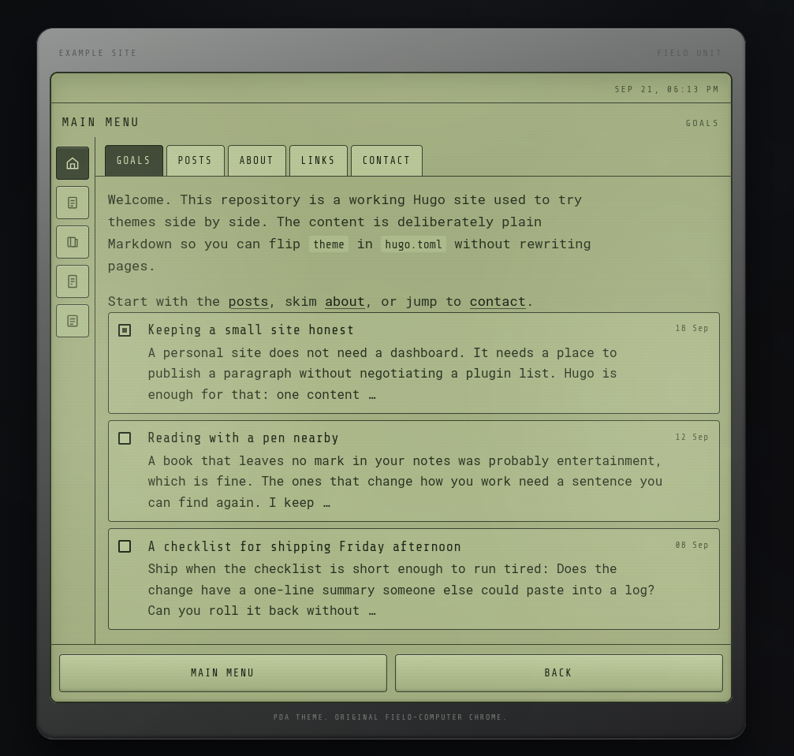
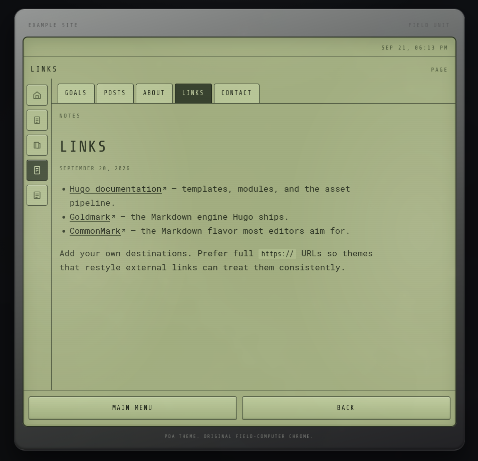

# PDA

## Welcome to Hugo Theme PDA

PDA is an original Hugo theme that looks like a field computer: olive bezel, phosphor text on a pale LCD, left-hand function keys, GOALS / NOTES / DATA tabs, and stacked records with status marks.

It is **not** a conversion of Ledger, Nightscape, or any HTML template. Body copy uses Roboto Mono at a size meant to stay readable. Scanlines and the grid sit at low opacity so they do not crush contrast.

---





### Preview locally with the bundled example site

```bash
cd exampleSite
hugo server --themesDir ../..
```

Then open `http://localhost:1313`.

### ⚠️ The theme needs at least Hugo **v0.160.0**.

Extended Hugo is **not** required (CSS is built with Hugo Pipes `css.Build`).

---

- [Features](#features)
- [How to start](#how-to-start)
- [How to run your site](#how-to-run-your-site)
- [How to configure](#how-to-configure)
- [Style parameters](#style-parameters)
- [Post front matter](#post-front-matter)
- [Post archetype](#post-archetype)
- [How to edit the theme](#how-to-edit)
- [Found a bug?](#bug)
- [License](#license)

## Features

- Field-computer chrome: gunmetal housing, pale olive LCD, soft screen glare
- Left-hand function-key rail driven by `menus.main` (up to four items)
- GOALS / NOTES / DATA tab strip on list and single views
- Stacked mission cards with optional `featured` status marks
- [**Roboto Mono**](https://fonts.google.com/specimen/Roboto+Mono) body and [**Share Tech Mono**](https://fonts.google.com/specimen/Share+Tech+Mono) UI (optional Google Fonts load)
- Color customization via `[params.style]` CSS variables (Hugo `css.Build` vars)
- Chroma syntax highlighting (`chromaStyle`, default `tango`)
- Fully responsive
- Built on Hugo Pipes, render hooks, and modules

## How to start

You can download the theme manually by going to [https://github.com/tgeek77/pda](https://github.com/tgeek77/pda) and pasting it to `themes/pda` in your site root.

You can also choose **one of the 3 possibilities** to install the theme:

1. as Hugo Module
2. as a standalone local directory
3. as a git submodule

⚠️ The theme needs at least Hugo **v0.160.0**.

### Install theme as Hugo Module

```bash
# If this is the first time you're using Hugo Modules
# in your project, initiate your own module before
# you fetch the theme module.
#
# hugo mod init [your website/module name]
hugo mod get github.com/tgeek77/pda
```

and in your config file add:

```toml
[module]
  # this is needed when you keep a local copy under themes/
  # replacements = "github.com/tgeek77/pda -> themes/pda"
[[module.imports]]
  path = 'github.com/tgeek77/pda'
```

Keep in mind that the theme by default won't show up in the `themes` directory. That means you are using the theme as it was on the repository at the moment you fetched it. Your local `go.sum` file keeps the references. Read more about Hugo Modules in the [official documentation](https://gohugo.io/hugo-modules/).

### Install theme locally

```bash
git clone https://github.com/tgeek77/pda.git themes/pda
```

This clones the repository directly to the `themes/pda` directory.

### Install theme as a submodule

```bash
git submodule add -f https://github.com/tgeek77/pda.git themes/pda
```

This installs the repository as a submodule in the `themes/pda` directory.

⚠️ If you encounter:

```bash
Error: module "pda" not found; either add it as a Hugo Module or store it in "[...]/themes".: module does not exist
```

then remove `theme = "pda"` from your config if you are using Hugo Modules only (module import is enough).

## How to run your site

With the theme installed locally under `themes/pda`:

```bash
hugo server -t pda
```

Or, from this repository's example site:

```bash
cd exampleSite
hugo server --themesDir ../..
```

Open `localhost:1313` in your browser. Changes go live without a full refresh in most cases.

## How to configure

The theme does not require advanced configuration. Start from something like:

```toml
baseURL = 'https://example.org/'
languageCode = 'en-us'
title = 'Watch Log'
# Add only if you keep the theme in the `themes` directory.
# Remove it if you use the theme as a remote Hugo Module.
theme = 'pda'

[pagination]
  pagerSize = 8

[params]
  description = 'Field notes from a handheld unit.'
  # Sections listed on the home page (default theme expects posts).
  mainSections = ['posts']
  # Right-side bezel label (falls back to the site host).
  unitName = 'FIELD UNIT'
  # Load Roboto Mono / Share Tech Mono from Google Fonts.
  googleFonts = true
  # Footer credit under the device chrome.
  showThemeCredit = true
  # Chroma style name for code blocks.
  # chromaStyle = 'tango'

  [params.author]
    name = 'Watch Officer'
    email = 'watch@example.org'

  # Optional color overrides — see Style parameters below.
  # [params.style]
  #   lcd = '#a8b484'
  #   text = '#2a3220'

[menus]
  [[menus.main]]
    name = 'Notes'
    pageRef = '/posts'
    weight = 10
  [[menus.main]]
    name = 'Tags'
    pageRef = '/tags'
    weight = 20
  [[menus.main]]
    name = 'About'
    pageRef = '/about'
    weight = 30

[taxonomies]
  tag = 'tags'

[outputs]
  home = ['html', 'rss']

[module]
  # In case you would like to make changes to the theme and keep it locally,
  # uncomment the line below (and correct the local path if necessary).
  # replacements = "github.com/tgeek77/pda -> themes/pda"
[[module.imports]]
  path = 'github.com/tgeek77/pda'
```

A working copy of this config lives in [`exampleSite/hugo.toml`](exampleSite/hugo.toml).

**NOTE:** The left function-key rail shows the home link plus up to **four** `menus.main` items.

## Style parameters

Colors are injected as CSS custom properties through Hugo `css.Build` vars under `[params.style]`. Defaults match a pale LCD with dark ink (not inverted):

| Key | Default | Role |
| --- | --- | --- |
| `desk` | `#0c0d0f` | Page background behind the device |
| `bezel` | `#6a6c6a` | Housing mid tone |
| `bezel-hi` | `#9a9c9a` | Housing highlight |
| `bezel-lo` | `#3a3c3a` | Housing shadow |
| `metal-edge` | `#222224` | Outer edge / border |
| `lcd` | `#a8b484` | Screen face |
| `lcd-deep` | `#8a9768` | Screen depth |
| `panel` | `#b8c694` | Raised panel |
| `panel-hi` | `#c5d3a2` | Panel highlight |
| `text` | `#2a3220` | Primary text |
| `muted` | `#4a5638` | Secondary text |
| `phosphor` | `#1e2616` | Strong ink / accents |
| `select` | `#3a4430` | Selection / active chrome |
| `select-text` | `#d4e0b0` | Text on selection |
| `dim` | `#6a7654` | Dim labels |
| `line` | `#3a4430` | Rules / borders |
| `ink` | `#1a2014` | Deepest ink |
| `glare` | `#e8f0c8` | Soft LCD glare |
| `danger` | `#5a4820` | Warning accent |

Example override:

```toml
[params.style]
  lcd = '#a8b484'
  text = '#2a3220'
  phosphor = '#1e2616'
```

Set `googleFonts = false` to skip loading Roboto Mono / Share Tech Mono (bring your own fonts if you want).

## Post front matter

Posts are ordinary Markdown. Useful fields:

```yaml
---
title: Radio check, north trail
date: 2026-03-12
featured: true
tags: [radio]
description: Optional summary for cards and meta.
---
```

- `featured: true` marks the card’s status tick as filled on list views.
- `tags` use Hugo’s standard taxonomy (see example site).

## Post archetype

Default archetype:

```toml
+++
date = '{{ .Date }}'
draft = true
title = '{{ replace .File.ContentBaseName "-" " " | title }}'
description = ''
+++
```

Create a new post with:

```bash
hugo new content posts/my-entry.md
```

## How to edit the theme `<a id="how-to-edit" />`

If you use the theme as a remote Hugo Module (no files under `themes/pda`) and you only need light CSS tweaks, add site-level CSS or override `[params.style]`.

If you have the theme files in `themes/pda`, edit them directly — no separate compilation step. CSS is rebuilt by Hugo Pipes on `hugo server` / `hugo`.

To develop against the bundled sample content:

```bash
cd exampleSite
hugo server --themesDir ../..
```

## Found a bug? `<a id="bug" />`

If you spot bugs, please use the [Issue Tracker](https://github.com/tgeek77/pda/issues) or open a [Pull Request](https://github.com/tgeek77/pda/pulls).

## License

Copyright © 2026 PDA contributors

The theme is released under the MIT License. See [`LICENSE`](LICENSE) for details.

PDA is an original Hugo theme. Olive housing and phosphor-on-LCD type are influenced by late-1990s military handheld computers. It is not a conversion of Ledger, Nightscape, or any HTML template.
